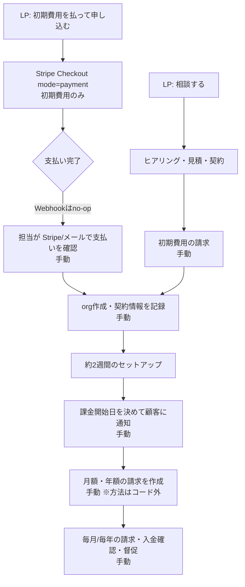
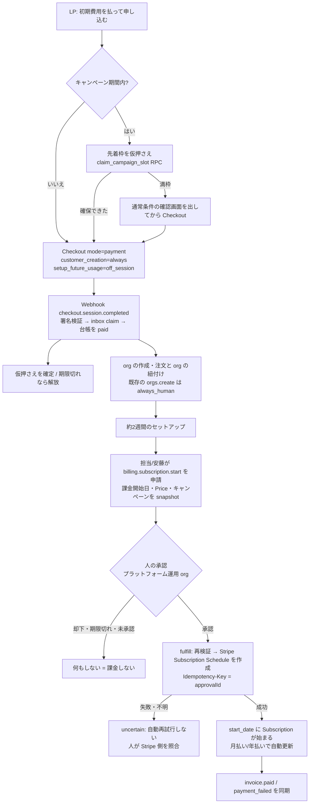
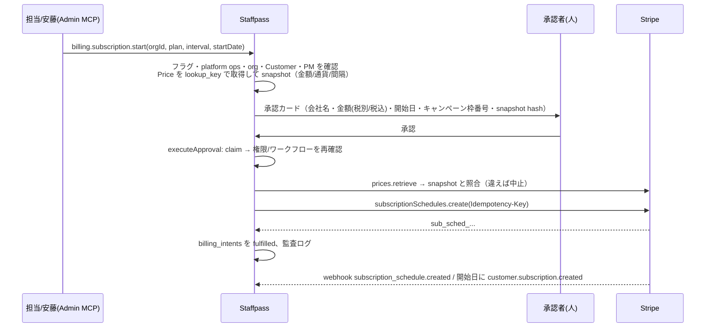

# AI社員パック 請求自動化（Stripe）設計メモ

- 日付: 2026-10-03（JST）
- 状態: **設計メモのみ・レビュー待ち**（コード実装なし。実装は八坂さんの GO 後）
- 依頼元: 木村 / 最終確認: 八坂さん
- 前提コード: `origin/main` @ `856264b`（2026-10-03 時点）
- 凡例: **【事実】** = コードで確認（パスを併記） / **【推測】** = コードから確定できない / **【提案】** = 本メモの設計案

---

## 0. 要約（TL;DR）

1. **現状、月額の請求はコード上どこにも自動化されていない。** LP の即決 Checkout は初期費用だけの `mode=payment` で、Webhook はその完了を記録しない（org に紐付かないので no-op）。月額は「別途契約で開始」と playbook にあり、手動運用。
2. **推奨方式**: ①初期費用は今の LP Checkout（`mode=payment`）を使い、その際にカードを保存する（`setup_future_usage=off_session`）。②セットアップが終わり**人が「課金開始」を承認した時点で初めて** Stripe に **Subscription Schedule**（`start_date` = 課金開始日）を作る。③先着100社は `start_date = max(通常の課金開始日, 2026-12-01 00:00 JST)` にする。④年額は年額 Price（`interval=year`）を使えば Stripe の標準動作で自動更新される。
3. **fail-closed**: 承認がない、または失敗したら Stripe に Subscription が**存在しない**ので課金は起こらない。「トライアルの期限が切れたら自動で課金」型（`trial_end` 方式）は、承認が来なくても期限で課金が始まるので主方式にしない。
4. お金が動く操作（課金開始・開始日変更・金額/プラン変更・返金・キャンセル・キャンペーン/クーポン適用・請求書 void）は全部 `billing.*` という Admin MCP ツールにまとめ、**always_human ＋プラットフォーム運用 org の承認者**だけが承認できるようにする。実行は既存の `executeApproval`（DB claim）と Stripe Idempotency-Key で exactly-once にする。
5. 先着100枠は DB の RPC で原子的に確保する（行ロック＋上限チェック）。Checkout セッションを作るときに仮押さえし、支払い完了で確定、期限切れで解放する。100社目と101社目の境界付近は人が確認する。
6. 全フラグは既定 OFF。段階的に有効化する（Webhook inbox だけ ON → テスト org の allowlist → 本番顧客）。
7. **未決事項**（§13）が多い。特に「10月申込」の定義、「12月以降」の意味（LP バナーは「**セットアップ開始**は12月以降」と書いていて、要件の「**月額開始**を12月以降」と食い違う）、月払いの請求日を何日にするか、承認者と金額の閾値、税の表示方法。

---

## 1. 業務要件（依頼内容）

| # | 要件 |
|---|------|
| R1 | 初期費用を支払った後、約2週間のセットアップ期間は無料。その後に月額課金を開始する |
| R2 | 10月申込の先着100社は、月額開始を12月以降にする |
| R3 | 年額プランは自動更新 |
| R4 | お金が動く操作（課金開始、金額変更、返金、キャンセル、キャンペーン適用など）には人の承認が必要 |

---

## 2. 現状（コードから確認した事実）

### 2.1 料金表示

- 【事実】LP カタログ（`lib/lp/catalog.ts` `HARDCODED_CATALOG`, `versionKey: "hardcoded-2026-10-01"`）。金額は税別。

  | sku | 表示名 | 初期費用 | 月額 | 年額表示 | 初期費用 Price の env |
  |-----|--------|---------:|-----:|---------:|------------------------|
  | intern | インターン | 150,000 | 50,000 | 540,000 | `STRIPE_PRICE_ID_AI_EMP_SETUP_INTERN` |
  | proper | プロパー | 150,000 | 150,000 | 1,620,000 | `STRIPE_PRICE_ID_AI_EMP_SETUP_PROPER` |
  | executive | エグゼクティブ | 300,000 | 300,000 | 3,240,000 | `STRIPE_PRICE_ID_AI_EMP_SETUP_EXECUTIVE` |
  | custom | カスタマイズ | 個別見積 | 個別見積 | – | なし |

  `LP_CATALOG_DB_ENABLED` が ON なら DB（`get_published_lp_catalog`）から読み、失敗したら上の固定値に戻る。
- 【事実】年払いは月額の10%オフ（`app/lp/ai-employee/PricingSection.tsx` `calcAnnualMonthly = monthly * 0.9`）。
- 【事実】特商法表記（`app/legal/commercial-transactions/page.tsx`）と利用規約第3条・第5条・第9条（`app/legal/terms/page.tsx`）の内容:
  - 無料トライアルはない。初期費用を払った後、約2週間のセットアップ期間は月額を請求しない。月額（年払いなら年額）は「セットアップ期間の経過後に**当社が通知する課金開始日**」から発生する。
  - 「キャンペーン等により課金開始日について別途条件を定める場合は、その条件による」。
  - 月払いは1か月ごと、年払いは1年ごとに自動更新。月払いは「月末までに解約の連絡があれば翌月から停止」。年払いは契約期間満了後の解約。
  - 月途中解約の日割返金、初期費用、提供済み役務の返金はしない（法令上必要な場合などを除く）。課金開始日より前に終了したら月額は発生しない。
- 【事実】LP のキャンペーンバナー（`app/lp/ai-employee/CampaignBanner.tsx`、コメントは "Temporary: early-bird 100 slots"）の文言は「**先行100枠｜セットアップ開始は12月以降**」「枠に達し次第、受付を終了します。」。**「10月申込」という条件も「月額開始」という言葉も LP には無い。** → 要件 R2 と表示が食い違う（§13 未決 U2）。
- 【事実】キャンペーンの判定・枠の管理をするコードはない（`rg "先着|100社|campaign"` はバナーと docs だけに当たる）。
- 【事実】旧 SaaS 価格（`lib/billing/plans.ts`: starter/business/managed、税込・仮決め）と旧パック（`lib/billing/packs.ts`: Lite/Standard）がまだ残っている。`docs/stripe-billing-notes.md` は旧体系を前提に「Price は税込で入れる」と書いているが、LP の新価格は**税別**。→ 税の扱いは未決（U10）。旧価格を消す作業は別ブランチ（`fix/remove-old-saas-prices-20261003`）で進んでいる【事実: worktree あり】。

### 2.2 Stripe 連携の現状

| 経路 | 内容 | 状態 |
|------|------|------|
| `lib/stripe.ts` | `getStripe()` は `STRIPE_SECRET_KEY` が無いか `replace_me*` なら null（スタブ）。SDK は `stripe@18.5.0`（API version `2025-08-27.basil`） | 【事実】 |
| `POST /api/lp/ai-employee/checkout` | LP 即決。Checkout `mode=payment`、初期費用の Price 1行だけ。metadata は `plan/setupYen/source=lp-ai-employee/planLabel/catalogVersion`（＋ledger ON なら `orderId`）。**Customer を作らない・カードを保存しない・orgId を持たない**。Origin チェックあり（Origin ヘッダが無ければ通す） | 【事実】 |
| `POST /api/billing/checkout` | 旧 SaaS 用。`mode=subscription` ＋ `trial_period_days: TRIAL_DAYS`（既定14）、starter/business/managed。Customer は org 単位で作成し `orgs.stripe_customer_id` に保存 | 【事実】。**この経路は承認なしで Subscription を作れる**。本番 env の `STRIPE_PRICE_ID_STARTER` 等が設定済みかは不明【推測】 |
| `POST /api/billing/portal` | Customer Portal セッションを発行。ログインと orgId は確認するが、**ロール（owner/admin）は確認していない** | 【事実】 |
| 外部契約カード登録（`lib/external-contract-card/*`） | `EXTERNAL_CONTRACT_CARD_SETUP` が OFF（既定）。always_human の承認 → `cardSetup.mintLink` を fulfill → Checkout `mode=setup`（15分で期限切れ、metadata `purpose=payment_method_setup, orgId, approvalId`）→ `setup_intent.succeeded` で `pm_...` だけ保存（PAN 等は保存しない） | 【事実】。§9 で**承認 → Stripe 書き込みのお手本**として流用する |
| Plan Rails（`lib/billing/plan-*.ts`, `P1_PLAN_RAILS_ENABLED`） | Price の `lookup_key` 体系 `staffpass_plan_{intern\|proper\|executive}_{monthly\|yearly}` と live の Product ID（`STRIPE_PRODUCT_IDS`）がコードにある。Subscription が更新された**後**に Webhook でアップグレードの承認チケットを作る | 【事実】。月額・年額の **Price が Stripe に実在するかは不明**【推測】 |
| LP 注文台帳（`lib/lp/order-ledger.ts`, `LP_ORDER_LEDGER_ENABLED`） | `lp_orders / lp_order_revisions / lp_checkout_attempts / lp_stripe_event_inbox`。`recordStripeEvent` と `updateOrderPaymentStatus` は**定義されているがどこからも呼ばれていない** | 【事実】 |

### 2.3 Webhook の現状（`app/api/webhooks/stripe/route.ts`）

- 【事実】署名は `stripe.webhooks.constructEvent(raw, signature, STRIPE_WEBHOOK_SECRET)` で検証している。失敗したら 400。
- 【事実】`STRIPE_WEBHOOK_SECRET` が無いか `replace_me*` のときは **200 `{stub:true}` を返して何も処理しない**（`docs/audits/card-setup-2026-09-28.md` の Low #4 で「意図的」と記録されている）。
- 【事実】org の特定は `client_reference_id` → `metadata.orgId`/`org_id` の順。**Customer ID と org の対応表で照合していない**。`orgs.stripe_customer_id` には UNIQUE 制約が無い（`supabase/schema.sql`）。
- 【事実】イベント ID の冪等性は Plan Rails の分（`stripe_processed_events`）だけ。しかも「確認してから insert」で原子的でなく、処理中にエラーが出ても processed として記録する（＝Stripe からの再送で回復しない）。購読の同期（`upsertSubscription`）とメール通知は冪等キー無しで毎回動く。
- 【事実】カード登録ハンドラが `complete_failed` / `missing_metadata` を返しても、その後のメイン処理を通って **200** を返す（Stripe は再送しない）。
- 【事実】`checkout.session.completed` は `session.subscription` があるか、orgId と customer の両方があるときだけ処理する。LP の初期費用セッションはどちらも無いので **no-op**。
- 【事実】`subscriptions.plan_key` には CHECK 制約 `('starter','business','managed')` がある。intern/proper/executive は入れられない（`resolvePlanKeyFromStripe` は不明なら `business` を返す）。新しいプランキーは `orgs.plan_key`（Plan Rails 用カラム）にある。

### 2.4 承認ワークフローの現状

- 【事実】`approval_requests` ＋ Admin MCP のキュー（`createApproval`、`metadata.always_human`、`adminRequester`）。自分の申請は自分で承認できない（`lib/admin-mcp/self-approval.ts`）。
- 【事実】実行は `executeApproval`（`lib/approvals/execution.ts`）を通る。`claim_approval_execution` / `finish_approval_execution` RPC で `running/succeeded/failed/uncertain` を管理する。**結果が分からない失敗（uncertain）は自動で再試行しない**。実行の直前に `assertApprovalExecutionAuthority`（承認者の権限がまだ有効か）と `canFulfillApproval`（`approval_workflow_can_execute` RPC。多段承認や quorum）を**もう一度**確認する。
- 【事実】プラットフォーム全体に効く操作（`orgs.*`）は `assertPlatformOpsFromAdminCred` で `PLATFORM_OPS_ORG_ID` とスーパー管理者の allowlist を確認する。どちらも未設定なら拒否（fail-closed）。
- 【事実】`sod_warn_policy.domains` には `money` という職務分離のドメインが既にある（警告用）。

### 2.5 ギャップ一覧（自動化の前に埋めるもの）

| # | ギャップ | 根拠 |
|---|----------|------|
| G1 | 初期費用の支払いが Staffpass に記録されない（Webhook が no-op、台帳の関数も呼ばれていない） | §2.3, §2.2 |
| G2 | 初期費用の Checkout でカードを保存しないので、後から月額を自動で引き落とせない | LP checkout route |
| G3 | 月額・年額の Subscription を作る経路は、旧 SaaS 用（承認なし・trial 付き）しかない | `/api/billing/checkout` |
| G4 | Webhook のイベント冪等性が一部だけで、原子的でない。エラーでも 200 を返す | §2.3 |
| G5 | Webhook で org を metadata から決めていて、Customer↔org の照合が無い | §2.3 |
| G6 | Customer Portal はどのメンバーでも開ける。Portal の設定次第で、顧客が承認を通さずにプラン変更（＝金額変更）できる | portal route【Portal の設定内容は Dashboard 側なので不明】 |
| G7 | キャンペーン枠の管理が無い | §2.1 |
| G8 | `subscriptions.plan_key` が新プランを入れられない | §2.3 |

---

## 3. 現状の手動フロー

根拠: `docs/ai-employee-pack-setup-playbook.md` §2・§3・§7（「Stripe Checkout は初期費用（一時金）のみ。月額サブスクは別途契約で開始」「将来: 自動で Staffpass org 作成 → 現時点は手動」）。月額を**実際にどう請求しているか**（Stripe ダッシュボードで請求書を作っているのか、銀行振込の請求書を出しているのか）はコードからは分からない【推測：ダッシュボードでの手動操作か、銀行振込】。



---

## 4. 自動化後のフロー【提案】

### 4.1 全体



### 4.2 「課金開始」のシーケンス



---

## 5. Stripe オブジェクト設計【提案】

### 5.1 Product / Price

| Product | Price | type | lookup_key | 備考 |
|---------|-------|------|------------|------|
| AI社員パック インターン | 初期費用 ¥150,000 | one_time | `staffpass_setup_intern`（新規） | 現行 env `STRIPE_PRICE_ID_AI_EMP_SETUP_INTERN` |
| 〃 | 月額 ¥50,000 | recurring month | `staffpass_plan_intern_monthly`（コードに既にある） | |
| 〃 | 年額 ¥540,000 | recurring year | `staffpass_plan_intern_yearly`（コードに既にある） | 10%オフは**別の Price** で表す（Coupon にしない） |
| プロパー | 150,000 / 150,000 / 1,620,000 | 同上 | `..._proper_...` | |
| エグゼクティブ | 300,000 / 300,000 / 3,240,000 | 同上 | `..._executive_...` | |
| カスタマイズ | 見積ごと | 個別の Price（`metadata.quote_id`） | なし | 作成自体を承認対象にする |

- Product は既存の live ID（`lib/billing/plan-scopes.ts` `STRIPE_PRODUCT_IDS`）を使う想定【推測: 実在するかはダッシュボードで要確認】。
- 金額はコードに書かない。実行時に `prices.list({lookup_keys})` で取り、承認 snapshot と照合する（Plan Rails の「金額のハードコード禁止」と同じ方針）。
- 税: LP は税別表示なので、Price の `tax_behavior=exclusive` ＋ Stripe Tax（または JP 消費税10%の Tax Rate）を推奨する。旧ドキュメントの「税込で入れる」とは逆になるので、決定が必要（U10）。

### 5.2 初期費用の決済（LP 即決）

- 今の `mode=payment` を続け、フラグ ON のときだけ次を追加する:
  - `customer_creation: "always"`（Customer を作る）
  - `payment_intent_data.setup_future_usage: "off_session"`（カードを後で使えるように保存する。Checkout 上で将来の請求への同意文言が出る【推測: Stripe 側で表示される文言は要確認】）
  - `metadata` / `payment_intent_data.metadata` に `orderId`、`campaignClaimId`（あれば）、`env`
  - `expires_at`（キャンペーン枠を仮押さえしたときだけ。Stripe の最小値は30分）
- 銀行振込（`customer_balance`）で払われた場合はカードが残らない。そのときの月額は `collection_method=send_invoice`（請求書払い）にする。
- 相談ファネル（見積→契約）の顧客は、承認後に Invoice（初期費用）＋カード登録リンク（既存の `cardSetup.mintLink` と同じ仕組み）を出す。

### 5.3 月額・年額を始める方式の比較

| 方式 | 内容 | R1 開始日の自由度 | R4 fail-closed | 法務表現「無料トライアルなし」 | 既存コードとの相性 | 判定 |
|------|------|------------------|----------------|------------------------------|--------------------|------|
| A. 申込時の Checkout `mode=subscription` ＋ 初期費用 one-time ＋ `subscription_data.trial_end` | 1回の Checkout で初期費用を取り、trial の終わりから月額 | `trial_end` は48時間以上先が必要。後から変更もできる | ✕ 承認が来なくても `trial_end` で**自動的に課金が始まる** | ✕ 状態が `trialing` になり、¥0 の請求書やリマインドに「トライアル」と出るおそれ | `/api/billing/checkout` と同じ形 | 不採用 |
| B. 承認時に Subscription を作成 ＋ `trial_end` = 課金開始日 | 承認されてから作る。開始日までは trialing | ◯ `trial_end` を更新できる | ◯ 承認前は存在しない | △ 状態名が trialing（顧客向けメールの設定で抑えられる可能性はある【推測】） | ◯ 既存の `customer.subscription.*` 同期がそのまま動く | **代替案** |
| C. 承認時に Subscription を作成 ＋ 未来の `billing_cycle_anchor` ＋ `proration_behavior=none` | 作った直後は active。最初の請求は anchor の日 | ✕ 作った後に anchor を動かしにくい | ◯ | ◯ | ◯ | 不採用（開始日の変更に弱い） |
| D. 承認時に **Subscription Schedule**（`start_date` = 課金開始日） | 開始日に Subscription が自動で生成される | ◯ 開始前なら phase を更新できる。開始前のキャンセルも簡単 | ◯ 承認前は存在しない。開始前に取り消せる | ◯ trial を使わない | △ `subscription_schedule.*` の Webhook 処理を追加する | **推奨** |
| E. Coupon（100%オフを N か月） | 今すぐ開始して、無料の月を割引で表す | △ | ◯ | △ ¥0 の請求書が出る | △ | キャンペーン用には不採用。本当の値引きにだけ使う |

**推奨は D**。理由: (1) 課金は「承認された時点」かつ「開始日」まで起こらない。(2) 規約の「当社が通知する課金開始日」とそのまま対応する。(3) trial という言葉が出ない。(4) 開始日がずれても、開始前なら phase 更新（これも承認対象）で済む。
D の実装が重いと判断したら B に切り替える。そのときは Stripe ダッシュボードで顧客向けのトライアル関連メールを止める。

Schedule のパラメータ案:

```text
subscription_schedules.create({
  customer: cus_...,                      // org の Customer（台帳と照合済み）
  start_date: <課金開始日 00:00 JST の unix>,  // 例: 2026-12-01 00:00 JST = 1796050800
  end_behavior: "release",                // phase が終わったら通常の Subscription として自動更新を続ける
  default_settings: {
    collection_method: "charge_automatically" | "send_invoice",
    default_payment_method: pm_... (カードのとき),
    invoice_settings: { days_until_due: N } (振込のとき),
  },
  phases: [{ items: [{ price: <lookup_key で取った price>, quantity: 1 }],
             iterations: 1,               // 1サイクル後に release（年額なら1年）
             metadata: { orgId, approvalId, intentId, campaignClaimId } }],
  metadata: { orgId, approvalId, intentId, env },
}, { idempotencyKey: "staffpass:billing:start:<approvalId>:v1" })
```

### 5.4 先着100社（R2）の開始日

- `start_date = max(通常の課金開始日, 2026-12-01T00:00+09:00)`。通常の課金開始日はセットアップ完了を受けて担当が申請する日。
- キャンペーンの適用自体は Coupon ではなく「開始日の下限」で表す（§5.3 E を使わない）。
- 年払いにもこの下限をかけるかは未決（U3）。

### 5.5 年額の自動更新（R3）

- `interval=year` の Price ＋ `end_behavior: "release"` にすれば、`cancel_at_period_end=false` のまま毎年自動で更新される（Stripe の標準動作）。
- 規約の「年払いは期間満了後の解約」→ 解約は `cancel_at_period_end=true`（期末で解約）として扱う。これも承認対象。
- 更新の何日前に案内するか（`invoice.upcoming` を使う／Stripe の更新リマインダー）は未決（U14）。

### 5.6 月払いの請求日

- 規約は「月末までに連絡すれば翌月から停止」。一方、Schedule は課金開始日を起点に毎月同じ日に請求する（例: 12/17 → 1/17）。**課金開始日が月の途中だと、規約の「翌月から停止」と請求サイクルが一致しない。** 毎月1日に揃えるなら最初の月を日割りにする phase 設計が要る。→ 未決（U8）。キャンペーン（12/1開始）は自然に1日揃いになる。

### 5.7 その他の操作の Stripe API 対応

| 業務操作 | Stripe 操作 | 承認 |
|----------|-------------|------|
| 課金開始 | `subscription_schedules.create` | 要 |
| 課金開始日の変更（開始前） | `subscription_schedules.update`（phases の start を変更） | 要 |
| 開始前の取り消し | `subscription_schedules.cancel` | 要 |
| プラン変更・金額変更 | `subscriptions.update`（items、`proration_behavior` を明示）または Schedule に phase を追加 | 要 |
| 月払い↔年払いの切り替え | Schedule に次の phase を追加（期末で切り替え） | 要 |
| 解約（期末） | `subscriptions.update({cancel_at_period_end:true})` | 要（顧客自身が Portal で行う場合は §8.5） |
| 即時解約 | `subscriptions.cancel` | 要 |
| 返金 | `refunds.create({payment_intent, amount})`。請求書なら Credit Note | 要（高額なら2段階を検討、U9） |
| キャンペーン適用/取消 | DB の枠確定＋`start_date` の下限 | 要 |
| クーポン適用 | `subscriptions.update({discounts})` | 要 |
| 請求書の void / 減額 | `invoices.voidInvoice` / Credit Note | 要 |
| カード登録・変更リンク | 既存の `cardSetup.mintLink` / `mintPortalLink` | 既に always_human |

---

## 6. 先着100社の判定と同時申込【提案】

### 6.1 判定の定義（決定が必要）

- 期間: `2026-10-01T00:00+09:00`（unix 1790780400）以上、`2026-11-01T00:00+09:00`（unix 1793458800）未満。**判定はサーバー側で JST を明示して行う**（Stripe のタイムスタンプは UTC の unix 秒）。
- 「申込」をどの時点とするか: 推奨は「**期間中に枠を仮押さえし、かつ初期費用の支払いが完了したもの**」。フォーム送信の時刻や契約締結の時刻にするかは U1。

### 6.2 データと原子性

```sql
-- 設計スケッチ（マイグレーションではない）
create table billing_campaigns (
  key text primary key,                 -- 'earlybird-2026-10'
  capacity int not null,                -- 100
  window_start timestamptz not null,
  window_end timestamptz not null,
  min_billing_start timestamptz not null, -- 2026-12-01 00:00 JST
  status text not null check (status in ('draft','open','closed'))
);
create table billing_campaign_claims (
  id uuid primary key default gen_random_uuid(),
  campaign_key text not null references billing_campaigns(key),
  order_id uuid references lp_orders(id),
  org_id uuid references orgs(id),
  stripe_checkout_session_id text unique,
  stripe_payment_intent_id text unique,
  slot_no int not null,
  state text not null check (state in ('held','confirmed','released','waitlisted')),
  held_until timestamptz,
  paid_at timestamptz,
  created_at timestamptz not null default now(),
  unique (campaign_key, order_id)
);
create unique index on billing_campaign_claims (campaign_key, slot_no)
  where state in ('held','confirmed');
-- RLS 有効・service_role のみ（lp_* テーブルと同じ）
```

- `claim_campaign_slot(p_campaign, p_order, p_hold_until)`（security definer）の処理:
  1. `select ... from billing_campaigns where key=p_campaign for update`（キャンペーン行をロックして、同時の呼び出しを直列にする）
  2. `now()` が期間内で、`status='open'` であることを確認
  3. 有効な枠を数える: `confirmed` ＋ `held_until > now()` の `held`
  4. 上限未満なら、空いている最小の `slot_no` で `held` を insert して返す。上限なら `full` を返す
  - 同じ `order_id` で呼ばれたら既存の行を返す（冪等）。
- 確定: Webhook `checkout.session.completed`（`payment_status=paid`）→ セッション ID で `held` を `confirmed` にし、`paid_at` を記録する。
- 解放: `checkout.session.expired` → `released`。取りこぼしは掃除ジョブでも解放する。
- 境界のケース: 仮押さえの期限が切れて他の人に枠が回った後で、元のセッションの支払いが完了した場合 → `waitlisted` にして人が判断する。`held_until` は Checkout の `expires_at` ＋ 少し余裕を持たせて、この状況が起こりにくくする。
- 満枠のとき: Checkout の前に「通常条件（キャンペーン対象外）」と明示した確認画面を出す（有利誤認の防止）。LP バナーを自動で下げるか、残り枠を表示するかは U4。
- 相談ファネルや手動の契約で枠を使う場合は、担当が `billing.campaign.apply`（承認対象）を申請し、同じ RPC で枠を取る。こうすれば上限は1か所で守られる。
- 銀行振込は入金が数日後になるので、仮押さえの期限と合わない。キャンペーンはカードだけにするか、振込の期日まで押さえるかは U6。
- 同じ法人による重複申込、キャンセルや返金のときに枠を戻すかは U5。
- 最終的には、`billing.subscription.start` の承認カードに枠番号・仮押さえ時刻・支払い時刻を出し、人が確認する。

---

## 7. 承認の差し込み位置と fail-closed【提案】

### 7.1 承認者（誰が承認するか）

- 課金は**当社（TOKYO307）の操作**なので、顧客 org の承認者には承認させない（自分への課金を自分で承認する形になるため）。
- 申請（`approval_requests`）は **`PLATFORM_OPS_ORG_ID` の org** に作り、`metadata.targetOrgId` に顧客の org を入れる。fulfill では `assertPlatformOpsFromAdminCred` と同じ確認をする（`orgs.*` と同じ方式）。
- `always_human: true`、`risk: "high"`、`purpose: "admin.billing.<action>"`（`isAdminClassApproval` に乗るようにする）、`auditClass: "billing"`。
- 申請者と承認者は別の人（`assertNotSelfApproval`）。返金や年額の解約など金額が大きい操作は、多段承認（`approval_workflow`、`onReject: fail_closed`）で2人目を必須にするかを検討する（U9）。

### 7.2 承認内容の固定（snapshot）

`billing_intents` テーブル【提案】に、承認の対象を変更できない形で保存する:

- `intent_id`、`approval_id`、`action`、`target_org_id`、`stripe_customer_id`
- `price_id`、`lookup_key`、`unit_amount`、`currency`、`interval`、`tax_behavior`（申請時に Stripe から取った値）
- `start_date`、`campaign_claim_id`、`refund_amount`、`payment_intent_id` など、操作ごとの引数
- `snapshot_hash`（承認カードに表示する）、`expires_at`（承認の期限）
- `status`: `pending_approval → approved → executing → fulfilled | failed | uncertain | rejected | expired`

### 7.3 実行（fulfill）の手順

既存の `fulfillApprovedAdmin` → `executeApproval` の中で `billing.*` を処理する:

1. フラグ（`BILLING_AUTOMATION_ENABLED` と操作ごとのフラグ）が ON か。OFF なら `feature_disabled` で終了（Stripe には書き込まない）
2. `assertApprovalExecutionAuthority` と `canFulfillApproval` の再確認（既存の処理）
3. platform ops の確認、`target_org_id` が allowlist に入っているか（段階的に有効化している間）
4. intent が `approved` で期限内か、`snapshot_hash` が一致するか
5. Stripe の現在の状態を取得して照合する: Price（active、金額・通貨・間隔が snapshot と一致）、Customer（`metadata.orgId` と台帳の両方が target と一致）、既に有効な Subscription/Schedule が無いか（二重開始の防止）
6. Stripe に書き込む。`idempotencyKey = "staffpass:billing:<action>:<approvalId>:v1"`
7. 結果を intent と監査ログに保存する

### 7.4 fail-closed の一覧

| 状況 | 結果 |
|------|------|
| フラグ OFF | Stripe に書き込まない。キューも `feature_disabled` |
| 承認が無い・却下・期限切れ・承認者の権限が取り消された | 実行しない（課金は存在しない） |
| snapshot と Stripe の Price が違う（ダッシュボードで金額が変わった等） | 中止 → 再申請が必要 |
| DB や Supabase に接続できない | `approval_execution_unavailable` で中止 |
| Stripe のタイムアウト等で結果が分からない | `uncertain`。自動では再試行しない。人が Stripe を見て照合する（同じ Idempotency-Key で24時間以内に再送すれば、重複せず同じ結果が返る） |
| Stripe キーのモード（test/live）が期待と違う | 中止（`BILLING_STRIPE_EXPECTED_MODE`） |
| Customer と org が一致しない | 中止＋警告 |

### 7.5 承認を通らずに Stripe 側でお金が動くもの

| 発生源 | 扱い |
|--------|------|
| 承認済み Subscription の毎月・毎年の更新、決済失敗の再試行（Smart Retries） | 開始の承認に含まれる。決済失敗時のサービス制限の方針は U13 |
| 顧客による Customer Portal の操作 | **Portal ではプラン変更を無効にし、解約は「期末」だけにする**。支払い方法の変更は許可する。Portal を開けるのは owner/admin に限る（今のルートにはロール確認が無い: G6） |
| 当社スタッフによる Stripe ダッシュボードでの直接操作 | 運用ルールで原則禁止（緊急時を除く）。Webhook で「当社 API の Idempotency-Key ではない変更」（`event.request.idempotency_key` が当社の形式でない等）を見つけたら警告し、監査ログに残す【推測: 判定に使うフィールドは実装時に要確認】 |
| 旧 `/api/billing/checkout`（承認なしで trial 付き Subscription を作る） | 請求自動化を ON にする前に無効化するか、フラグで止める（U12） |
| Plan Rails の「Stripe 更新後にアップグレード承認」（`processSubscriptionForPlanChange`） | 金額はすでに変わっているので、R4 の「事前承認」にならない。請求自動化の下では、プラン変更は `billing.subscription.changePrice` の事前承認を唯一の経路にする |

---

## 8. Webhook・冪等性・テナント分離・秘密情報【提案】

### 8.1 署名検証

- 今の `constructEvent` を使い続ける（raw body、`runtime=nodejs`）。
- **変更点**: 本番（デモでない）で `BILLING_AUTOMATION_ENABLED` が ON なのに `STRIPE_WEBHOOK_SECRET` が無いときは、200 のスタブではなく **503** を返す（Stripe が再送し、ダッシュボードで失敗が見える）。OFF のときは今のまま。
- `event.livemode` が env の期待（test/live）と一致しなければ拒否する。

### 8.2 冪等性

- 既にある `lp_stripe_event_inbox`（`UNIQUE(environment, account_id, event_id)`、`status` 列）を全イベント共通の inbox にする:
  1. 検証後すぐに `insert ... on conflict do nothing returning id` で取得（claim）する。取得できなければ処理済みか処理中なので 200 を返す。
  2. `processing` → 処理 → `processed`。一時的な失敗は `failed` にして **5xx** を返し、Stripe に再送させる（今の「エラーでも processed」をやめる）。
  3. `processing` のまま一定時間止まっている行は再処理できるようにする。
- ハンドラ自体もオブジェクト ID 単位で冪等にする（`payment_intent_id` や `stripe_subscription_id` に UNIQUE、状態遷移は「前の状態を条件にした update」で書く）。
- イベントの順番は保証されないので、状態は payload を信じず `retrieve` で取り直す（今の invoice の処理と同じ）。
- 当社から Stripe への書き込みは、すべて承認 ID を元にした Idempotency-Key を付ける。

### 8.3 テナント分離

- org はまず `customer` → `orgs.stripe_customer_id`（**UNIQUE 制約を追加**）で引き、`metadata.orgId` と一致するか照合する。一致しなければ書き込まずに隔離（inbox を `failed`＋警告）。
- LP の初期費用（org がまだ無い）は `metadata.orderId` → `lp_orders` に記録する。org との紐付けは担当の操作（承認対象）で行い、`lp_orders.org_id` を設定する。
- 新しいテーブルは RLS を有効にして service_role だけ（`lp_*` と同じ）にする。顧客向けの請求画面は、サーバー側で org メンバーかを確認したうえで自分の org の分だけ返す。
- 承認の対象 org は `metadata.targetOrgId` に固定し、fulfill の時点で intent と Stripe の Customer の両方で照合する。

### 8.4 秘密情報

- `STRIPE_SECRET_KEY` はサーバーだけで使う。本番は **Restricted Key**（必要な権限だけ: Customers、Checkout Sessions、Subscriptions/Schedules、Prices の読み取り、Refunds、Invoices）にすることを推奨する。
- Webhook の署名秘密はエンドポイントごとに分ける。ローテーションの手順を runbook に書く。
- ログには ID（`cus_`, `sub_`, `pi_`, `evt_`）と金額だけを出す。payload 全体、カード情報、メールアドレスはログに出さない（カード登録モジュールの方針を踏襲）。
- テストでは本物のキーを使わない。`scripts/test-local.mjs` は env を空にし、`.env` を読まず、ネットワークを遮断して動く【事実】。Stripe はモックかスタブで試す。
- 通知先の `BILLING_NOTIFY_EMAIL` は今 `owner@example.com` に戻るようになっている【事実】。本番でフラグを ON にするときは必須にする。

---

## 9. データモデル案（スケッチ・マイグレーションではない）

| テーブル/変更 | 目的 |
|---------------|------|
| `billing_intents`（新） | 承認 snapshot と実行状態（§7.2） |
| `billing_campaigns` / `billing_campaign_claims`（新） | 先着枠（§6.2） |
| `org_billing_contracts`（新）: `org_id`、`plan_key`、`interval`（month/year）、`collection_method`、`billing_start_date`、`stripe_schedule_id`、`stripe_subscription_id`、`status` | 契約台帳の正本（playbook の「Staffpass が契約台帳の正本」を実体にする） |
| `orgs.stripe_customer_id` に UNIQUE（部分 index、null を除く） | テナント分離 |
| `lp_orders.org_id`（新しい列）＋ `stripe_payment_intent_id` UNIQUE | 初期費用と org の紐付け |
| `subscriptions.plan_key` の CHECK に intern/proper/executive を追加、または `org_billing_contracts` に一本化 | G8 |
| `lp_stripe_event_inbox` を共通の inbox として使う（`processing` の止まり対策の列を追加） | §8.2 |

---

## 10. フラグ設計（すべて既定 OFF）【提案】

既存の `parseFlag`（`true/1/on/enabled`）と同じ書き方にする。

| フラグ | 効果 | 依存 |
|--------|------|------|
| `BILLING_AUTOMATION_ENABLED` | 全体のスイッチ。OFF なら新しい経路はすべて動かず、今の動作と同じ | – |
| `BILLING_WEBHOOK_INBOX_ENABLED` | 全イベントを inbox で claim し、失敗時は 5xx を返す | 単独で先に ON にできる |
| `BILLING_LP_SAVE_CARD_ENABLED` | LP の Checkout で Customer を作り、カードを保存する | 全体 |
| `BILLING_MONEY_OPS_ENABLED` | `billing.*` のキューと fulfill（Stripe への書き込み） | 全体 |
| `BILLING_EARLYBIRD_CAMPAIGN_ENABLED` | 枠の仮押さえ・確定。期間や上限は DB（`billing_campaigns`）で持ち、env には置かない | 全体 |
| `BILLING_ORG_ALLOWLIST` | お金の操作を許す org ID（カンマ区切り）。段階的に有効化する間、空なら全部拒否 | 全体 |
| `BILLING_STRIPE_EXPECTED_MODE` | `test` / `live`。キーの種類と一致しなければ中止 | 全体 |

段階的な有効化:

1. **段階0**: コードをフラグ OFF のままマージする。「フラグ OFF で今と同じ動作」の回帰テスト（`tests/security/p1-kind-routes-flags-off-regression.test.ts` と同じ形）を用意する。
2. **段階1（本番以外）**: Stripe テストモード ＋ **Test Clocks** で時間を進めて確認する: 初期費用 → 2週間 → 承認 → 開始 → 月次更新、年額の更新、12/1 開始、決済失敗、返金、101社目、同時申込。
3. **段階2（本番）**: 八坂さんの GO の後、マイグレーションを適用し、`BILLING_WEBHOOK_INBOX_ENABLED=1` だけを ON にする（観察するだけ）。
4. **段階3**: ダッシュボードの設定（§11）。`BILLING_AUTOMATION_ENABLED=1`、`BILLING_STRIPE_EXPECTED_MODE=live`、`BILLING_ORG_ALLOWLIST=<社内テスト org>`、`BILLING_MONEY_OPS_ENABLED=1` にする。本物のお金で少額の確認と返金をするか（その場合も承認を通す）は U15。
5. **段階4**: `BILLING_LP_SAVE_CARD_ENABLED=1`。
6. **段階5**: allowlist に実際の顧客を追加していき、最後に allowlist を外す。
7. **キャンペーン**: `billing_campaigns` を `open` にし、`BILLING_EARLYBIRD_CAMPAIGN_ENABLED=1`。期間が終わったら `closed`。
8. **切り戻し**: フラグを OFF にすれば新しい書き込みはすぐ止まる。作成済みの Schedule/Subscription は Stripe 側に残るので、一覧を見て個別に対応する（取り消しも承認を通す）。

---

## 11. 本番で必要な操作の一覧（すべて八坂さんの GO の後）

### 11.1 Stripe ダッシュボード

| # | 操作 |
|---|------|
| S1 | 月額・年額の Price（3プラン×2）を作る。`lookup_key` を `staffpass_plan_*_{monthly\|yearly}` にする。既にあるかを先に確認する |
| S2 | 初期費用の Price に `lookup_key` を付ける（または今の env の ID を確認する）。`tax_behavior` を決める |
| S3 | 税の設定（Stripe Tax か Tax Rate 10%）。請求書に適格請求書の登録番号を載せる設定（custom field / footer） |
| S4 | Customer Portal: プラン変更を OFF、解約は期末のみ、支払い方法の更新は ON |
| S5 | Webhook エンドポイントにイベントを追加: `checkout.session.completed` / `.expired` / `.async_payment_succeeded` / `.async_payment_failed`、`subscription_schedule.*`、`customer.subscription.*`、`invoice.paid` / `.payment_failed` / `.finalized` / `.upcoming`、`charge.refunded`、`charge.dispute.created` |
| S6 | Restricted API Key を発行する（§8.4） |
| S7 | 方式 B を選んだ場合: 顧客向けのトライアル関連メールを OFF |
| S8 | 銀行振込（customer_balance）を使うなら有効化する |
| S9 | 決済失敗時の再試行（Smart Retries）と、未払いのときの Subscription の扱いを設定する（U13 に合わせる） |

### 11.2 env（Vercel）

`BILLING_*` フラグ（§10）、`STRIPE_SECRET_KEY`（Restricted Key に差し替えるなら）、`STRIPE_WEBHOOK_SECRET`（エンドポイントを分けるなら）、`PLATFORM_OPS_ORG_ID`（未設定なら）、`BILLING_NOTIFY_EMAIL`（必須にする）。

### 11.3 SQL（マイグレーション）

§9 のテーブルと制約。事前の確認クエリ（読み取りだけ）:

- `orgs.stripe_customer_id` に重複が無いか（UNIQUE を付ける前に）
- `subscriptions` に旧プランの行が何件あるか
- `lp_orders` / `lp_checkout_attempts` に残っているデータ

`billing_campaigns` の初期データ（`earlybird-2026-10`, 100, 期間, 下限 2026-12-01 JST）は、内容が決まってから入れる。

---

## 12. テスト計画（実装するとき）

- 単体: 開始日の計算（JST の境界、12/1 の下限）、snapshot の照合、フラグ OFF で何も起こらないこと、Idempotency-Key の形式、Customer↔org の不一致で隔離されること
- RPC: 100枠に対して並列に 150 本 claim → confirmed＋held がちょうど100、slot_no が重複しない（ローカルの PGlite/Postgres で。本番 DB は使わない）
- Webhook: 同じ event を2回送る → 1回だけ処理される。失敗 → 5xx。署名不正 → 400。secret が無く automation ON → 503
- 承認: 未承認・却下・期限切れ・自己承認・権限取り消し・Price の不一致 → Stripe を呼ばないこと（モックの呼び出し回数が0）
- E2E: Stripe テストモード＋Test Clocks（本番キーは使わない）

---

## 13. 未決事項（八坂さんに決めていただきたい点）

| # | 論点 | 選択肢 / 推奨 |
|---|------|---------------|
| U1 | 「10月申込」の定義と時刻の基準 | 推奨: JST で期間中に枠を仮押さえし、支払いが完了したもの。他の案: フォーム送信時刻 / 契約締結時刻 |
| U2 | 「月額開始を12月以降」の意味と LP 表示の食い違い | LP は「セットアップ開始は12月以降」。(a) 月額開始の下限が12/1（要件どおり。LP の文言を修正） (b) セットアップ開始が12月（LP どおり。その結果、月額は12月中旬以降） |
| U3 | 年払いにもキャンペーンを適用するか | 推奨: 適用する（年額の開始日も12/1以降） |
| U4 | 枠の対象（プランを問わず100社か、カスタマイズ/相談経由を含むか）、残り枠の表示、満枠でバナーを自動で下げるか | 推奨: 全プラン共通で100社。相談経由も同じ枠で数える |
| U5 | 同じ法人の重複申込、キャンセル・返金時に枠を戻すか | 推奨: 1法人1枠。課金開始前のキャンセルは枠を戻す |
| U6 | 銀行振込で初期費用を払う場合の仮押さえ期間 | 推奨: キャンペーンはカードのみ。または振込期日まで押さえる |
| U7 | 課金開始日の決め方（セットアップ完了を誰が判定するか、何日前に通知するか） | 推奨: 担当が完了を記録 → 顧客に通知 → 承認 → 開始 |
| U8 | 月払いの請求日（課金開始日を起点にするか、毎月1日に揃えるか）と、規約の「月末までに連絡で翌月停止」との整合 | 1日に揃えるなら最初の月を日割りにするか決める |
| U9 | 承認者（誰が承認するか）、金額の閾値で2段階承認にするか、返金・年額解約の扱い | 推奨: 返金と年額の即時解約は2人承認 |
| U10 | 税（税別 Price ＋ Stripe Tax か、税込 Price か）、適格請求書の記載 | 推奨: LP に合わせて税別（exclusive）＋10% |
| U11 | Customer Portal で顧客に許す操作 | 推奨: 支払い方法の変更と期末解約だけ |
| U12 | 旧 SaaS の Checkout（`/api/billing/checkout`、`TRIAL_DAYS`）とサインアップ時の「トライアル」メールの扱い | 推奨: 請求自動化を ON にする前に無効化（規約の「無料トライアルなし」とも矛盾している） |
| U13 | 決済失敗時のサービス制限（past_due になって何日で止めるか） | – |
| U14 | 年額更新の事前案内（何日前に、どの手段で） | – |
| U15 | 本番で少額のお金を使って確認と返金をするか | – |
| U16 | 今手動で請求している既存顧客を Stripe の自動請求に移すか、その手順 | – |
| U17 | キャンペーン条件をどこに書くか（規約・特商法の「別途条件」として、LP にキャンペーン規約を載せる） | 法務の確認が必要 |

---

## 14. 参照したコード

- `lib/stripe.ts`, `app/api/webhooks/stripe/route.ts`, `app/api/billing/checkout/route.ts`, `app/api/billing/portal/route.ts`
- `app/api/lp/ai-employee/checkout/route.ts`, `lib/lp/catalog.ts`, `lib/lp/order-ledger.ts`, `supabase/migrations/20261001100000_lp_catalog_orders.sql`
- `lib/external-contract-card/*`, `supabase/migrations/20260923_external_contract_card_setup.sql`, `docs/audits/card-setup-2026-09-28.md`
- `lib/billing/stripe-plan-webhook.ts`, `lib/billing/stripe-events.ts`, `lib/billing/plan-scopes.ts`, `lib/billing/plan-upgrade-handler.ts`, `supabase/migrations/20261001000100_plan_rails.sql`
- `lib/approvals/execution.ts`, `lib/approvals/execution-authority.ts`, `lib/approvals/workflow-integration.ts`, `lib/admin-mcp/fulfill-admin.ts`, `lib/admin-mcp/self-approval.ts`, `lib/admin/platform-ops-gate.ts`
- `app/legal/commercial-transactions/page.tsx`, `app/legal/terms/page.tsx`, `app/lp/ai-employee/CampaignBanner.tsx`, `app/lp/ai-employee/PricingSection.tsx`
- `lib/feature-flags.ts`, `supabase/schema.sql`, `docs/ai-employee-pack-setup-playbook.md`, `docs/stripe-billing-notes.md`, `docs/plan-rails.md`
- Stripe の仕様（2026-10 時点の公式ドキュメント）: Checkout の `subscription_data.trial_end` は48時間以上先が必要。trial の期間は730日以内。Checkout では trial と `billing_cycle_anchor` を同時に使えない。subscription モードの Checkout では one-time の明細は最初の請求書で即時に請求される。Subscription Schedule は `start_date` を未来にでき、phase ごとに `trial_end` を持てる。
