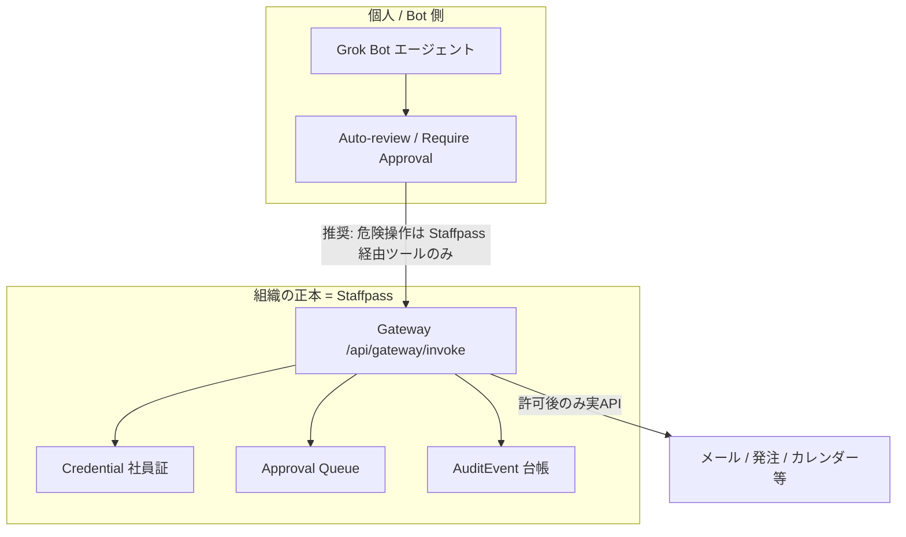

# Staffpass Gateway と Grok Auto-review — 関係図（C2）

**更新:** 2026-08-23（木村採択）  
**読者:** 実装・営業・安藤レビュー  
**結論:** 組織の正本（社員証・承認台帳・説明責任）は **Staffpass**。Grok Auto-review は個人／Bot側の安全網であり、代替ではない。

---

## 一文

| 層 | だれのため | 何をする | 正本か |
|----|------------|----------|--------|
| **Grok Auto-review / Require Approval** | 個人・Botオペレータ | Bot内蔵の「判断が必要なとき戻る」ネット | いいえ（クライアント側） |
| **Staffpass Gateway** | 会社・Org | 社員証検証・目的／スコープ・承認キュー・監査台帳・失効 | **はい（組織の正本）** |

---

## 関係図



```
[人手 or Routine/Teach]
        ↓
[Grok Bot] ──(個人ネット)──► Auto-review（任意・Bot設定）
        ↓ 許可ツールは staffpass.* のみ（Managed）
[Staffpass Gateway] ──(組織台帳)──► 検証 → 承認 → 実行 → Audit
        ↓
説明責任・失効・コストは会社側に残る
```

---

## 混同しないためのルール

1. **Auto-review の置き換えを名乗らない。** Staffpass は組織ポリシー・RBAC承認者・エクスポート・失効・社員別コストまで含む。  
2. **二段説明で固定:** Auto-review＝個人／Bot側ネット。Staffpass＝会社の台帳。  
3. **確定系（confirm / send / order）** は Staffpass で always_human。Routines / Teach 経由でも同じ（C4）。  
4. Partner API が無い間、実行フックは限定的 → **Managed** で危険直結を外し、迂回は事後ヘルス・監査で補う（ハイブリッド）。

詳細の守り方: [`enforcement-auto-vs-manual.md`](./enforcement-auto-vs-manual.md)

---

## 営業トーク（短）

> Grok 側にも承認ネットがあります。Staffpass はそれとは別に、**会社の社員証と監査台帳**です。Bot を分けても公式は共有コンピュータなので、境界は社員証側に置きます。
