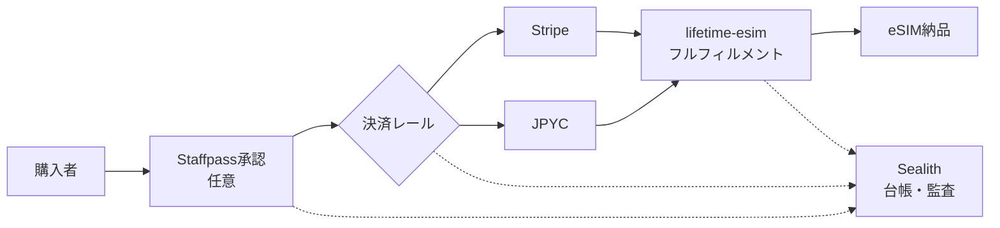
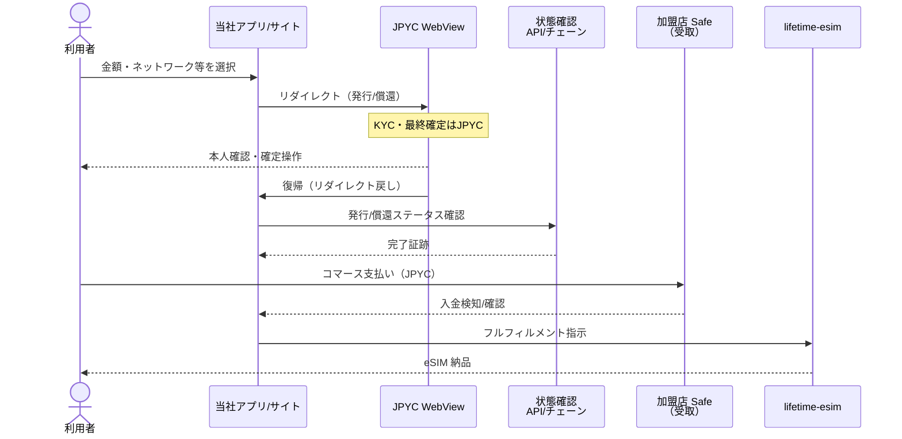
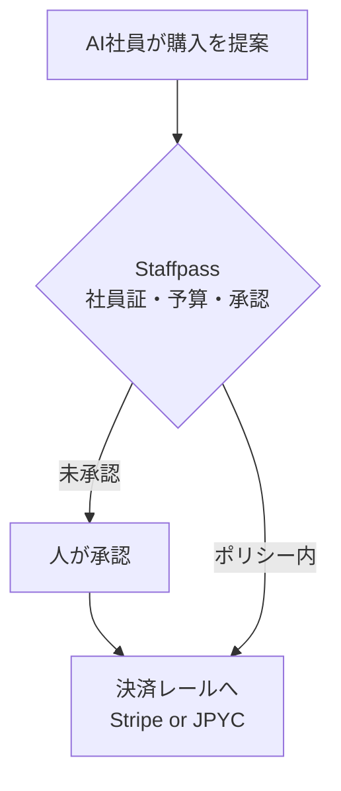
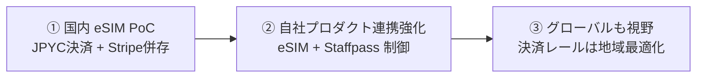

# JPYC × Sealith / lifetime-esim — アーキテクチャ概要

相手方共有用（NDA締結済）。技術の専門家以外の経営者にも読める平易な説明を心がけています。  
**秘密情報（APIキー・シード・個人鍵）は含みません。**

| 項目 | 内容 |
|------|------|
| 版 | 2026-08-23 |
| 対象 | JPYC株式会社 様 / 当社（TOKYO307 / Sealith） |
| 関連 | 近接PoC：lifetime-esim.com の商品決済（JPYC ＋ 既存 Stripe） |

---

## 0. ひとことで言うと

お客さまが eSIM を買うとき、**クレジットカード（Stripe）か JPYC** で支払えるようにする、というのが直近の PoC です。

JPYC で「円相当のステーブルコインを手元に用意する」部分は、**JPYC の画面（WebView）で本人確認と最終確定**を行い、当社は金額の入力や画面へのつなぎ（導線）を担当します。当社はお客さまのコインや鍵を預かりません。

AI社員（Staffpass）は、将来「AIが買い物を提案する」ときに社長が止められるための仕組みで、今回の JPYC 連携の主役ではありません（任意のガバナンス層）。

---

## 1. 登場人物（役割）

| 役割 | 誰 | 何をするか | 何をしないか |
|------|-----|------------|--------------|
| **JPYC** | JPYC株式会社 | KYC、発行／償還の最終確定、JPYC EX WebView の提供 | 当社の商品フルフィルメント |
| **当社（接続・加盟店）** | TOKYO307 / Sealith | 購入導線・UX、lifetime-esim の手配、受取ウォレット（Safe想定）、台帳・監査 | 利用者資産のカストディ、無人S2Sミント |
| **利用者** | 購入者（個人／法人） | 自己管理ウォレット、購入意思、JPYC画面での確認 | — |
| **AI社員（Staffpass）** | Grok Bot 上の制御プレーン | （任意）発注提案の承認・上限・監査 | JPYC API の直接操作・無人発行 |

---

## 2. 全体像（ハイレベル）

購入から eSIM お渡しまでの大きな流れです。



**読み方（平易）**

1. 購入者が商品を選ぶ。  
2. （将来・任意）AI社員経由なら Staffpass で上限・承認を見る。人の購入ならスキップ可。  
3. 支払い方法を選ぶ：Stripe または JPYC。  
4. 支払いが確認できたら lifetime-esim が eSIM を手配・お渡し。  
5. 誰が何を承認し、どのレールで払ったかを台帳に残す（説明責任用）。

---

## 3. JPYC EX オンランプ → コマース決済（シーケンス）

「コインを用意してから、加盟店（当社 Safe）へ支払う」までの順序です。



**ポイント**

- **導線は当社、本人確認と最終確定は JPYC。**  
- **無人の Server-to-Server 発行はしない**（人が WebView で確定する前提）。  
- 発行／償還の完了を確認してから、商品代金の支払い → eSIM 手配、という順序を基本とする（詳細は実装時に双方で詰める）。  
- 受取は **当社の Safe（マルチシグ想定）**。利用者鍵は当社が持たない。

---

## 4. ノンカストディの整理

```
[利用者の自己管理ウォレット] --支払--> [当社 受取 Safe（想定）]
         ↑ 鍵は利用者のみ                    ↑ 加盟店オペレーション
         Sealith は預からない
```

- 当社は「つなぐ・見せる・記録する・商品を渡す」側。  
- コインの発行者としての最終判断は JPYC。  
- したがって、利用者のシードや秘密鍵を当社サーバーに置く設計にはしない。

---

## 5. Staffpass の位置（軽量）



- PoC の最小構成では **人がサイトから直接購入**でも成立する。  
- Staffpass は「AIが勝手に買えない」ためのゲートであり、**JPYC 接続仕様の本体ではない**。

---

## 6. ロードマップ（山のイメージ）



| 段階 | 内容 | 注意 |
|------|------|------|
| ① いま | lifetime-esim で JPYC 支払いを試す | 無人発行しない・カストディしない |
| ② 次 | 承認・監査と決済のつなぎを厚くする | 契約・ライセンス論点を並行 |
| ③ 将来 | 海外展開も視野 | **決済レールは地域ごとに最適化**。JPYC の海外展開を当社が約束しない |

---

## 7. PoCでやること / やらないこと（再掲）

| やる | やらない |
|------|----------|
| eSIM 商品の JPYC 決済（Stripe 併存） | 無人 S2S ミント／発行 |
| WebView オンランプの UX 接続 | 利用者 JPYC・鍵のカストディ |
| Safe 受取・台帳・監査 | 本資料範囲外の新規金融商品組成 |

---

## 8. 用語のやさしい対応表

| 用語 | 意味 |
|------|------|
| eSIM | スマホに通信プランを後から入れる仕組み。lifetime-esim の商品。 |
| JPYC | 円に連動するステーブルコイン（詳細は JPYC 公式）。 |
| WebView | アプリやサイトの中に開く JPYC の公式画面。 |
| オンランプ | 円などから JPYC を手元に用意する流れ。 |
| Safe | 複数人承認などを想定した受取用ウォレット。 |
| ノンカストディ | 会社がお客さまの鍵・資産を預からないこと。 |
| Staffpass | AI社員の「社員証・承認・記録」プロダクト。 |

---

## 9. 次の技術確認（宿題候補）

1. PoC 対象ネットワークとテスト手順  
2. 発行／償還完了の検知方法（API とチェーン証跡の優先）  
3. Safe アドレスの管理・ローテーション方針  
4. ユーザー向け画面文言（誰が何を確定するか）  
5. 障害時の切り分け（当社導線 vs JPYC WebView）

---

*TOKYO307 / Sealith — 相手方共有可*  
*本資料は設計意図の共有であり、契約条件そのものではありません。*
