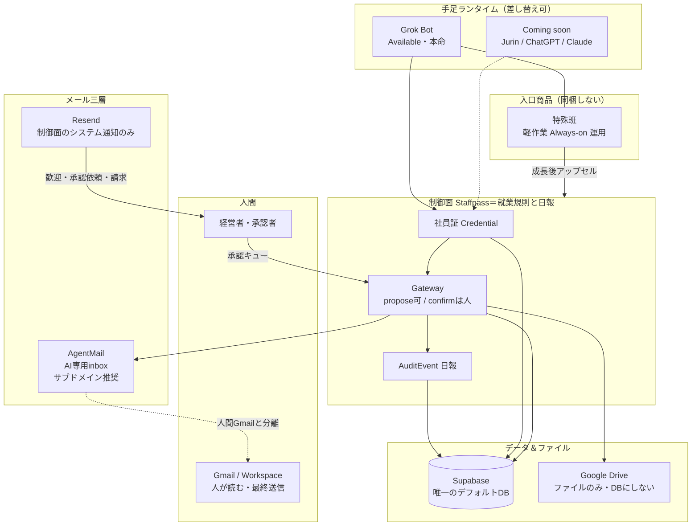

# TOKYO307 デフォルトスペック（内外部展開用・1枚）

> **注記:** Staffpass実装正本は `internal-share/00`・`01`。本紙はTOKYO307横断の標準環境正本。

**更新:** 2026-08-24 安藤  
**用途:** 自社実証・顧客導入・パートナー説明の共通「標準環境」  
**思想（Rise / Jurin CEO も同型）:** 落ちるのはモデルではなく **統合・知識・自律度**。モデルは差し替え、境界は就業規則と日報。

---

## 0. 一文

> TOKYO307のデフォルトは、**手足（まずGrok Bot）＋制御面（Staffpass）＋薄い運用入口（特殊班）**。データはSupabase、メールは三層、確定は人。Jurin／ChatGPT／Claudeは順次の手足候補。

---

## 1. 全体図



---

## 2. レイヤ別・採用ツールの位置付け

| レイヤ | デフォルト | 役割 | やらないこと |
|--------|------------|------|--------------|
| **手足** | **Grok Bot**（Pro+ / Teams Standard〜） | 共有PC上の作業・Routines・Bot班 | Bot分割＝安全境界、とは言わない |
| **手足（点線）** | Jurin / ChatGPT / Claude | 電話入口・既存エージェント社員化 | 未接続なのに対応済みと書かない |
| **制御面** | **Staffpass** | 社員証・承認・監査・課金 | Auto-reviewの代替を名乗らない |
| **入口運用** | **特殊班** | 軽作業常駐パック（当社が席を代行運用可） | 初期にStaffpassを同梱しない |
| **DB** | **Supabase** | Org / Employee / Credential / Approval / Audit の正本 | DriveやシートをDBにしない |
| **ファイル** | **Google Drive** | 添付・共有ドキュメント | 構造化データの正本にしない |
| **例外DB** | GCP等 | 重い顧客のみ | デフォルトにしない |
| **人間メール** | **Gmail / Workspace** | 人が読む・最終判断の机 | エージェントに人間inboxを丸投げしない |
| **AIメール** | **AgentMail** | 1 AI社員＝1 inbox。送受信・スレッドAPI | ルートMXをGmailと二重にしない（`agents.`推奨） |
| **通知** | **Resend** | 歓迎・承認依頼・トライアル・請求などシステム通知 | 営業メール／エージェント会話に流用しない |
| **決済** | **Stripe** | Staffpass月額・キックオフ・meter | Grok席の再販をしない |
| **協業UI** | Slack / Calendar 等 | 許可されたコネクタ経由 | 許可外アカウントは fail-closed |

---

## 3. 自律度（デフォルトの就業規則）

| 自動してよい | 人が押す |
|--------------|----------|
| 調査・比較・要約・下書き・候補枠 | 対外送信の確定 |
| 日次リスト・レポート案 | 課金・返金・広告費 |
| propose系ツール | 契約印・NDA |
| Resendのシステム通知 | 炎上・法務など例外 |

外部コンテンツ（Web／メール本文／ツール出力）は**参考であり、新アクションの権限にならない**。

Instructionsは三層: **Base（固定）／Role（職種）／Skills・Routines（変わりもの）**  
→ https://grokbot-control-plane.vercel.app/guides/instructions-design

---

## 4. 商品の置き方（内外部で同じ物語）

```
特殊班（入口・軽作業） ──成長・監査・機密──▶ Staffpass（就業規則と日報）
         │                                      │
         └──────── 手足はまず Grok Bot ─────────┘
```

- **社内:** 特殊班5体で犬食い評価 → 乗ったら外販。制御面は必要になったら足す  
- **外販・Staffpass顧客:** 手足Grok＋社員証。キックオフ／Business等はカタログ正本  
- **パートナー（AIコンシェル等）:** 電話入口は別職種。紹介は `referral_code`、初年度10%仮  

---

## 5. Rise論考との対応（設計の言葉）

| Riseが言う失敗要因 | TOKYO307の答え |
|--------------------|----------------|
| 統合がない | コネクタ＋Gateway。全部プロキシは約束しない（Hybrid） |
| 知識が散在 | Instructions三層＋（将来）KB。いまはガイド公開まで |
| 自律度が未定義 | propose / confirm、always_human の表 |
| フォローが2% | 特殊班 Lead→Email下書き。To取得と送信は人 |

成功サイン: 2週間で「これもできる？」。失敗サイン: ログイン減→「合わない」。

---

## 6. 明示的に売らない約束

OS完全分離／学習100%停止／マスキング100%／全部プロキシ／補助金必ず出る／Bot分割＝境界／未接続ランタイムの対応済み／**Vercel型AI Gateway（経路・単価）の再販**／**Grok席の再販**

（知能が安くなり利用が増えるほど、止めるルールと日報の相対価値が上がる。制御面は就業規則と日報であり、モデル経路の卸ではない。）

---

## 7. 参照

- Live LP: https://grokbot-control-plane.vercel.app/  
- 構想: `staffpass-concept-latest.md`  
- ミニマム対応表: `staffpass-minimum-map.md`  
- 本ファイル: `tokyo307-default-stack.md`
- 営業FAQ（AI Gatewayとの切り分け）: `internal-share/04-sales-security-faq.md` §H
